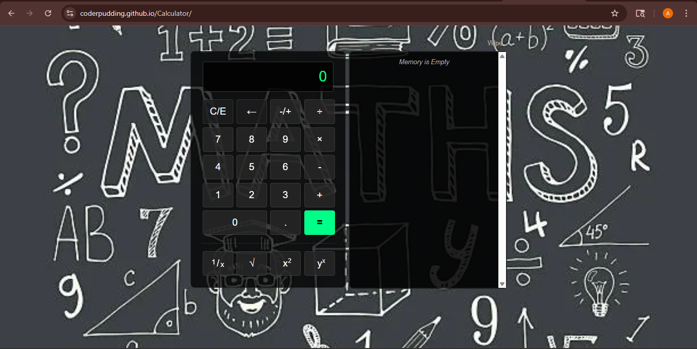

## Calculator

A calculator I built using HTML CSS and JQuery, it can do addition, subtraction, multiplication, division and also square roots, powers, and reciprocals, Has a memory panel on the side that keeps track of every calculation so you can reuse old results without having to type them again

---

## Preview

---

## How to use

### Mouse

- Click any button to input numbers and operators
- Click **C/E** to clear, **←** to backspace, **-/+** to toggle to negative or postive
- Every result appears in the memory pannel, click **use** to reuse it and **Wipe** to clear the memory pannel

## KeyBoard Shortcuts

| Key                | Action            |
| ------------------ | ----------------- |
| '0-9'              | Input Numbers     |
| '.'                | Decimal point     |
| '+'                | Add               |
| '-'                | subtract          |
| '\*'               | Multiply          |
| '/'                | Divide            |
| '^'                | Power             |
| '=' or 'Enter'     | Calculate         |
| '←' or 'Backspace' | Delete last digit |

### Extra Function

- **√** — Square root of current number
- **x²** — Square current number
- **¹/x** — Reciprocal (1 divided by current number)
- **yˣ** — Raise current number to any power

---

## Live Demo

[Try it here](https://coderpudding.github.io/Calculator/)
